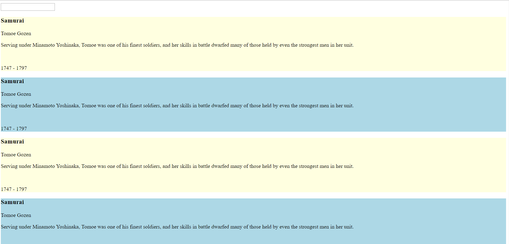

## What you see

This project is an exploration of basic event listeners, variable environments, and dom manipulation.  By clicking on a card you can highlight the clicked on element and then use the text input to update the text of the highlighted element.  The new value is stored into the object array.

## Screenshots


## How to run this project
* Use npm to install http-server in your terminal:
```sh
npm install -g http-server
```
* Run the server
```sh
hs -p 9999
```
* Open chrome and navigate to:
```
localhost:9999
```
*  By clicking on a card you can highlight the clicked on element and then use the text input to update the text of the highlighted element.  The new value is stored into the object array.